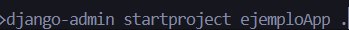
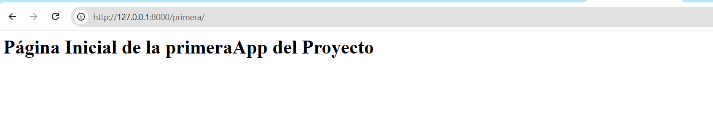
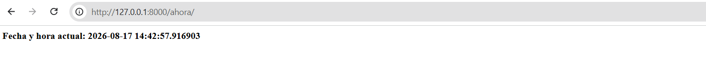

# Proyecto Django - Guía de Inicio

Guía paso a paso para crear y configurar un proyecto Django desde cero, incluyendo la creación de una app, vistas y rutas básicas.

## Requisitos previos

- Python instalado
- pip actualizado
- Visual Studio Code (opcional, recomendado)

## 1. Creamos un entorno virual y lo activamos

```bash
python -m venv venv

.\venv\Scripts\Activate.ps1
```

## 2. Verificar la versión de Python y Si esta instalado

```bash
python --version
```

## 3. Actualizar pip

```bash
python -m pip install --upgrade pip
```

## 4. Instalar Django

```bash
pip install django
```

## 5. Verificar la instalación

```bash
python -m django --version
```

## 6. Guardar las dependencias del proyecto

Útil para compartir el proyecto o reinstalar las mismas dependencias en otro entorno:

```bash
pip freeze > requirements.txt
```

Para instalar las dependencias desde ese archivo en otro entorno:

```bash
pip install -r requirements.txt
```

## 7. Crear el proyecto

```bash
D:\pythonProyect\Django\2023>django-admin startproject ejemploApp .
```


Esto genera automáticamente la carpeta del proyecto `ejemploApp`.

## 8. Abrir la terminal integrada de VS Code

Menú **Ver → Terminal**

## 9. Ejecutar el servidor de desarrollo

```bash
D:\pythonProyect\Django\2023\ejemplo> python manage.py runserver
```

Al abrir la URL indicada en la terminal (por defecto `http://127.0.0.1:8000/`) en el navegador, deberías ver la página de bienvenida de Django ("The install worked successfully! Congratulations!").

> Nota: es normal ver un mensaje sobre migraciones pendientes (`unapplied migration(s)`). Se pueden aplicar con `python manage.py migrate`.

## 10. Configurar idioma y zona horaria

En el archivo `ejemplo/settings.py`, modificar:

```python
LANGUAGE_CODE = 'es-cl'   # antes: 'en-us'

TIME_ZONE = 'America/Santiago'   # antes: 'UTC'
```

## 11. Crear una aplicación dentro del proyecto

```bash
D:\pythonProyect\Django\2023\ejemplo> python manage.py startapp primeraApp
```

## 12. Registrar la app en `settings.py`

Agregar `'primeraApp'` a la lista `INSTALLED_APPS`:

```python
INSTALLED_APPS = [
    'django.contrib.admin',
    'django.contrib.auth',
    'django.contrib.contenttypes',
    'django.contrib.sessions',
    'django.contrib.messages',
    'django.contrib.staticfiles',
    'primeraApp',
]
```

## 13. Crear una vista inicial

En `primeraApp/views.py`:

```python
from django.shortcuts import render
from django.http import HttpResponse
import datetime

# Create your views here.
def inicio(request):
    return HttpResponse("<h1>Página Inicial de la primeraApp del Proyecto</h1>")

def ahora(request):
    hora = datetime.datetime.now()
    salida = "<b>Fecha y hora actual: {}</b>".format(hora)
    return HttpResponse(salida)
```

- `inicio`: función que responde a la ruta principal de la app.
- `ahora`: función que muestra la fecha y hora actual, usando la librería `datetime`.

## 14. Configurar las rutas del proyecto

En `ejemploApp/urls.py`:

```python
from django.contrib import admin
from django.urls import path
from primeraApp import views

urlpatterns = [
    path('admin/', admin.site.urls),
    path('primera/', views.inicio),
    path('ahora/', views.ahora),
]
```

- Se importa el módulo `views` de `primeraApp` para poder usar sus funciones.
- Cada `path()` asocia una URL con la función de vista correspondiente.

## 15. Probar las rutas

Con el servidor corriendo (`python manage.py runserver`), visitar en el navegador:

- `http://127.0.0.1:8000/primera/` → muestra el mensaje de bienvenida de la app.



- `http://127.0.0.1:8000/ahora/` → muestra la fecha y hora actual, por ejemplo:


  ```
  Fecha y hora actual: 2023-08-18 15:50:30.700544
  ```

## Estructura final del proyecto

```

 ejemploApp/
├── __init__.py
├── asgi.py
├── settings.py #Cambiamos la Zona Horario ## ingresamos la aplicación nueva 
├── urls.py  # Creamos las rutas llamando a las funciones de la aplicación 
└── wsgi.py

├── primeraApp/
│   ├── migrations/
│   ├── __init__.py
│   ├── admin.py
│   ├── apps.py
│   ├── models.py
│   ├── tests.py
│   └── views.py #Creamos las vista de la aplicación
├── db.sqlite3
└── manage.py  # Corremos el servidor con python manage.py runserver  , # Creamos aplicaciones también python manage.py startapp primeraApp
```